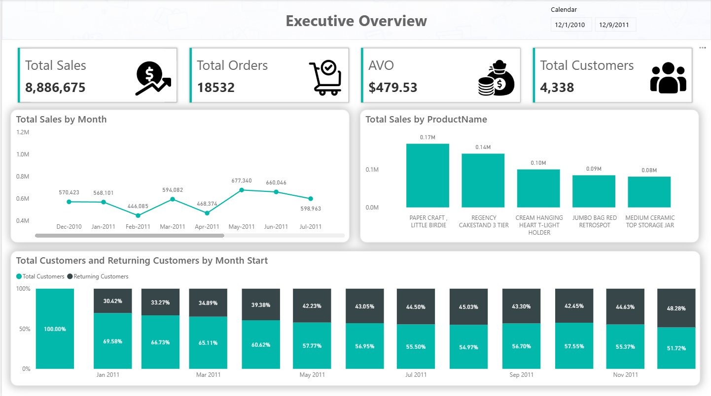
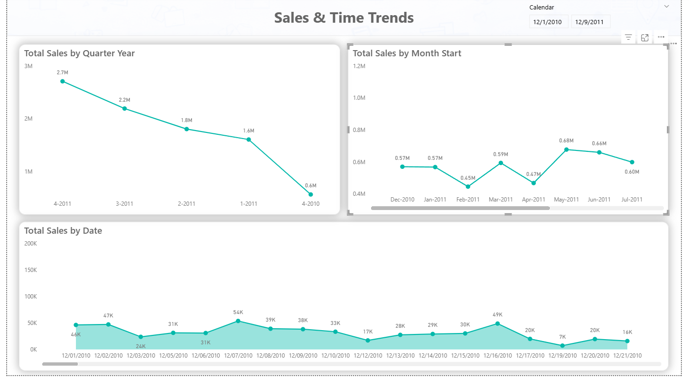
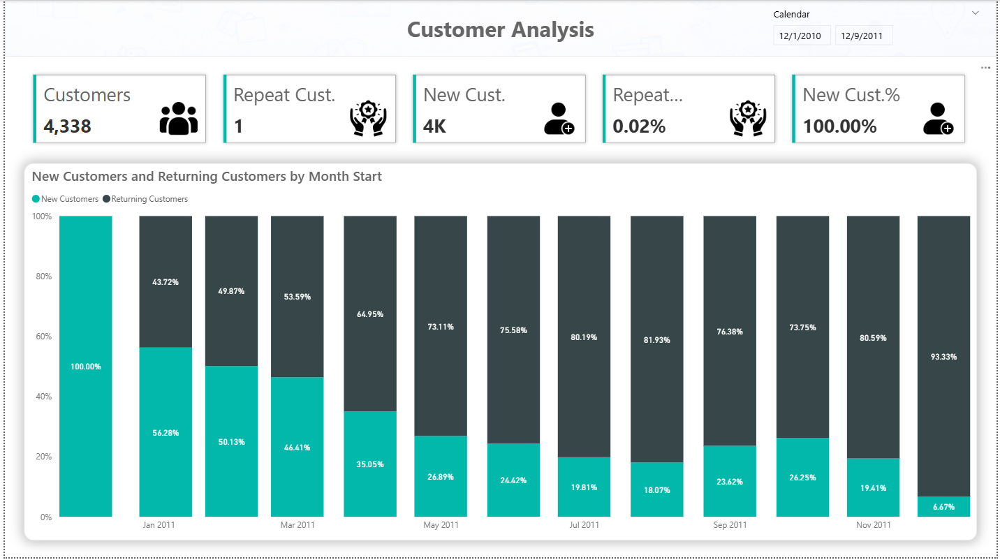
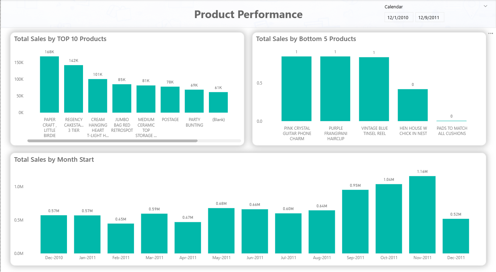

# Retail Sales Analytics Dashboard

## 📌 Project Overview
This project demonstrates an end-to-end Retail Sales Analytics solution built using Power BI, SQL, DAX, and Snowflake.

The dashboard helps business users analyze sales performance, profitability, customer trends, and regional insights through interactive visualizations and KPI tracking.

---

## 🛠 Tools & Technologies
- Power BI
- SQL
- DAX
- Snowflake

---

## 📊 Key Features
- Executive KPI Dashboard
- Sales Trend Analysis
- Profitability Analysis
- Regional Performance Tracking
- Customer Segmentation
- Interactive Filtering & Drillthrough
- Time Intelligence Calculations

---

## 🏗 Data Model
This project follows a star schema data model approach using fact and dimension tables for optimized reporting performance.

---

## 📁 Repository Structure

| Folder | Description |
|---|---|
| Dashboard-Screenshots | Dashboard preview images |
| SQL-Scripts | SQL queries and transformations |
| DAX-Measures | DAX calculations and measures |
| Documentation | Project documentation and case study |
| Architecture | Solution architecture diagrams |
| Dataset | Sample dataset files |

---

## 📈 Business Insights
- Identified top-performing sales regions
- Analyzed monthly sales growth trends
- Improved visibility into profitability metrics
- Enabled data-driven business decision making

---
## 🚀 Future Enhancements
- Row-Level Security (RLS)
- Incremental Refresh
- Advanced Forecasting
- Power BI Service Deployment

---  
## 📊 Dashboard Preview

---

## 📚 Project Documentation

### KPI Definitions
Detailed KPI business definitions and DAX measures are available in the Documentation folder.

### SQL Scripts
SQL scripts used for:
- Fact table creation
- Dimension modeling
- Monthly sales analysis
- Data transformations

### DAX Measures
Key business KPIs and calculations implemented using DAX:
- Total Sales
- Average Order Value
- Sales YoY
- Returning Customers
- Time Intelligence Measures

